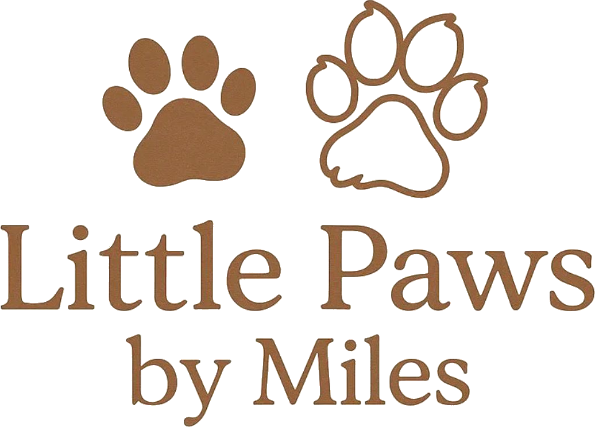

# Little Paws By Miles — Website

A static website for Little Paws By Miles, a small UK cat breeder specialising in Ragdolls, Maine Coons, and British Shorthair.

Built with plain HTML, CSS, and JavaScript, with a Decap CMS admin panel so non-technical editors can update content without touching code.

## 🚀 Setup & deployment

- **New owner? Start here:** [`HANDOVER_GUIDE.md`](./HANDOVER_GUIDE.md) — walks through getting the site live on Cloudflare Pages with GitHub + Decap CMS. Takes about 45 minutes, one-time setup.
- **Non-technical editor?** Read [`EDITOR_GUIDE.md`](./EDITOR_GUIDE.md) — short and friendly.

## 🛠 How the CMS works

Content lives in `/content/` as markdown files (one per cat, kitten, litter, testimonial). Editors use the Decap CMS at `/admin/` to edit these via a friendly web form. On every save, Cloudflare Pages runs `scripts/build-data.js` which regenerates `js/data.js` from the markdown. The site JavaScript reads `data.js` at runtime and renders the pages.

**You should never edit `js/data.js` by hand** — it's auto-generated and your changes will be overwritten.

---

## 📁 Project structure

```
little-paws-by-miles/
├── HANDOVER_GUIDE.md          ← ⭐ Setup instructions (read first)
├── EDITOR_GUIDE.md            ← Send to Mum & Mark
├── README.md                  ← This file
├── package.json               ← Tells Cloudflare how to build the site
│
├── admin/                     ← The CMS
│   ├── index.html             ← Loads Decap CMS
│   └── config.yml             ← ⭐ Schema — defines what editors see
│
├── content/                   ← ⭐ EDITABLE CONTENT (via CMS or directly)
│   ├── cats/                  ← One markdown file per cat
│   ├── kittens/               ← One file per available kitten
│   ├── litters/               ← One file per upcoming litter
│   ├── testimonials/          ← One file per testimonial
│   └── settings/              ← Business info, form URLs
│
├── scripts/
│   ├── build-data.js          ← Runs on every deploy, regenerates js/data.js
│   └── migrate.js             ← One-time migration (already run)
│
├── index.html                 ← Home page
├── cats.html                  ← Meet the Cats
├── cat.html                   ← Individual profile (uses ?id=...)
├── available-kittens.html     ← Available kittens + waitlist
├── upcoming-litters.html      ← Planned litters
├── stud-services.html         ← Stud services + booking
├── testimonials.html          ← Full testimonials page
├── contact.html               ← Contact form
│
├── sitemap.xml                ← SEO — submit to Google Search Console
├── robots.txt                 ← Tells search engines what to crawl
│
├── css/style.css              ← All styles (brand palette at the top)
│
├── js/
│   ├── data.js                ← ⚠️ AUTO-GENERATED — do not edit
│   ├── main.js                ← Renders content from data.js
│   └── partials.js            ← Injects shared header/footer
│
├── partials/
│   ├── header.html            ← Nav bar
│   └── footer.html            ← Footer
│
└── images/
    ├── favicon.svg
    ├── logo.png               ← Full logo (transparent)
    ├── logo-paws.png          ← Paws-only mark used in nav
    ├── logo.jpeg              ← Original uploaded logo
    ├── cats/                  ← Cat photos
    ├── kittens/               ← Kitten photos
    └── uploads/               ← CMS media uploads land here
```

---

## 🎨 Brand

The site follows the Little Paws By Miles brand guidelines (Edition 01, April 2026):

- **Primary background:** Cream `#F5EFE6`
- **Secondary surfaces:** Deep cream `#E8DFCA`
- **Headings & logo:** Brown `#926440` (matches the logo)
- **Calls to action:** Blue `#6D94C5`
- **Soft accent:** Pale blue `#CBDCEB`
- **Typography:** Fraunces (display) + DM Sans (body) via Google Fonts

To update the palette, edit the `:root` custom properties at the top of `css/style.css`.

---

## 🔍 SEO

The site is fully optimised for search engines:

- Unique title and description on every page
- Canonical URLs pointing to `https://littlepawsbymiles.co.uk/...`
- Open Graph and Twitter Card tags for nice social-media previews
- `sitemap.xml` listing every page and cat profile
- `robots.txt` pointing to the sitemap
- Structured data (JSON-LD) on the homepage describing the business as a `LocalBusiness` / `PetStore`
- Per-cat structured data injected into each profile page

**Once your real domain is set up:**
1. Update the `url` field in `js/data.js` section 5 (`BUSINESS.url`)
2. Search for `littlepawsbymiles.co.uk` across all `.html` files and the `sitemap.xml` and replace with your actual domain
3. Submit `https://yourdomain.co.uk/sitemap.xml` to [Google Search Console](https://search.google.com/search-console)


## ✏️ How to update content

**99% of updates happen in one file: `js/data.js`**

Open it in any text editor (Notepad, VS Code, etc.) and follow the comments. You can update:

- **Your cats** (names, breeds, photos, registration, personality)
- **Available kittens** (add new ones, mark as reserved, remove when sold)
- **Upcoming litters** (expected dates and litter sizes)
- **Testimonials** (add new reviews anytime)
- **Social links** (if your handles ever change)
- **Form URLs** (your Tally / Typeform embed URLs)

Save the file and refresh the site — changes appear immediately.

### Adding photos

1. Save your photo into `images/cats/` (for cats) or `images/kittens/` (for kittens).
2. In `js/data.js`, update the relevant `photos` array with the path, e.g.  
   `photos: ["images/cats/luna-01.jpg", "images/cats/luna-02.jpg"]`
3. Square photos (1:1 ratio) work best — the site will crop any shape nicely, but square avoids awkward cropping.

### Marking a kitten as reserved or sold

In `js/data.js`, find the kitten object. Either:
- Change `status: "Available"` to `status: "Reserved"` — the card shows a "Reserved" badge and hides the button.
- Delete the whole object (with its surrounding `{ }` and the trailing comma) once the kitten has gone to their new home.

### When there are no available kittens

Leave the `KITTENS` list empty: `const KITTENS = [];`  
The page will automatically show a friendly "no kittens available right now" message with the waitlist form.

---

## 📝 Setting up forms (Tally — recommended, free)

1. Go to **[tally.so](https://tally.so)** and create a free account.
2. Create a form for each purpose:
   - **Kitten enquiry / reservation**
   - **Waitlist signup** — capture: name, email, breed preference (Ragdoll / Maine Coon / British Shorthair / Any)
   - **Stud booking** — capture: owner name, contact details, queen's breed, vaccination status, preferred dates, notes
   - **General contact**
3. Publish each form → click "Share" → "Embed" → copy the URL (starts with `https://tally.so/embed/...`).
4. In `js/data.js`, paste each URL into the matching `FORMS` variable:

```js
const FORMS = {
  kittenEnquiry: "https://tally.so/embed/xxxxxx",
  waitlist:      "https://tally.so/embed/xxxxxx",
  studBooking:   "https://tally.so/embed/xxxxxx",
  contact:       "https://tally.so/embed/xxxxxx"
};
```

Save, refresh, done. Forms appear automatically. Until a URL is added, a friendly placeholder shows in its place.

Typeform works exactly the same way — just use the Typeform embed URL instead.

---

## 🖼️ Swapping in the real logo

When the logo is ready:

1. Save the logo as `images/logo.png` (or `.svg`).
2. Open `partials/header.html`.
3. Find this block:
   ```html
   <span class="logo-mark" aria-hidden="true">🐾</span>
   <span class="logo-text">Little Paws By Miles</span>
   ```
4. Replace it with:
   ```html
   
   ```

That's it — the logo will now appear on every page.

---

## 🚀 Hosting (free, secure, easy)

### Option 1 — Netlify (easiest)

1. Go to [netlify.com](https://netlify.com) → "Add new site" → "Deploy manually".
2. Drag the entire `little-paws-by-miles` folder into the upload box.
3. Netlify gives you a free `something.netlify.app` URL — your site is live.
4. You can add a custom domain later (e.g. `littlepawsbymiles.co.uk`) in Netlify's settings.

To update: just re-upload the folder, or use Netlify's drag-and-drop on existing sites.

### Option 2 — GitHub Pages

1. Create a free GitHub account.
2. Create a new repository named `little-paws-by-miles` (or anything).
3. Upload all the files from this folder.
4. In the repo: **Settings → Pages → Source: main branch, `/root` folder** → Save.
5. Your site goes live at `https://yourusername.github.io/little-paws-by-miles/`.

Both options give you free HTTPS (secure) automatically.

---

## 📱 Design notes

- **Responsive**: looks great on phones, tablets, and desktops.
- **Photo layouts are forgiving**: square crop grids with soft borders handle mixed-quality phone photography well — no full-bleed hero images to struggle with.
- **Colour palette** (all editable at the top of `css/style.css`):
  - Cream base `#FAF6F0`
  - Deep cream `#F3EADA`
  - Sage green `#8A9A7B` (primary accent)
  - Warm terracotta `#C98F7C` (call-to-action accent)
  - Charcoal `#3A3633` (body text)

---

## ❓ Troubleshooting

**Nothing appears on the page when I open the HTML file directly.**  
Modern browsers block the partial-loading `fetch()` call when you open HTML files from your computer (using `file://`). This is not a problem once hosted on Netlify or GitHub Pages. To preview locally, run a simple local server:

```bash
# If you have Python installed:
cd little-paws-by-miles
python3 -m http.server 8000
```

Then visit `http://localhost:8000`.

**My photos don't show up.**  
Check that the path in `data.js` matches exactly where you put the photo (case-sensitive). `images/cats/luna.jpg` is different from `images/Cats/Luna.jpg`.

**I broke `data.js` and now nothing loads.**  
Look for a missing comma, quotation mark, or bracket. Every `{ }` object must end with a comma *unless* it's the last one in the list. If stuck, revert to the original file.

---

Enjoy the site! 🐾
